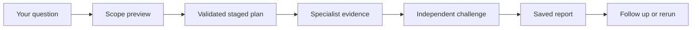

# TradingCodex

<div align="center">
  <a href="https://pypi.org/project/tradingcodex/"></a>
  <a href="LICENSE"></a>
  
  
</div>

### The question is easy. Trusting the answer is the hard part.

TradingCodex turns one investment question into a reviewable Codex workflow:
specialist evidence, independent challenge, source and as-of metadata,
uncertainty, and a report saved in your own workspace.

**Ask naturally. Watch the team work. Keep the evidence.** Trading actions stay
behind explicit policy, approval, idempotency, broker, and audit gates.

[Quick start](#quick-start) · [Run your first analysis](#run-your-first-analysis) · [See what you get](#what-you-get) · [Safety](#safety-you-do-not-have-to-remember) · [Docs](docs/README.md)

## What You Get

| You do | TradingCodex does | You keep |
| --- | --- | --- |
| Ask in natural language or choose a built-in skill. | Scopes the request and records a validated staged plan. | The original constraints and an integrity-bound workflow record. |
| Follow the run in the local workbench. | Coordinates only the required fixed-role specialists. | Agent, tool, source, artifact, blocker, and forecast status. |
| Review or challenge the result. | Requires source-aware artifacts and independent judgment review before synthesis. | Markdown research, reports, source snapshots, forecasts, and follow-up history. |

TradingCodex is local-first and Codex-native. It is not an autonomous trading
bot, and a natural-language answer never becomes a broker action.

## Quick Start

You need `uvx` and an installed, authenticated `codex` CLI. Run this inside the
empty workspace where you want your research files to live.

macOS or Linux:

```bash
cd /path/to/your/empty-workspace
uvx --refresh --from tradingcodex tcx attach . && ./tcx doctor
./tcx service ensure
```

Native Windows PowerShell:

```powershell
cd C:\path\to\your\empty-workspace
uvx --refresh --from tradingcodex tcx attach .
.\tcx.cmd doctor
.\tcx.cmd service ensure
```

Open the workbench immediately at:

```text
http://127.0.0.1:48267/
```

To use the same workspace inside the Codex app, fully quit and restart Codex,
open the generated workspace, trust the project, and start a new task so its
project MCP config, prompts, skills, and hooks load together.

The Python package already contains the compiled React workbench. End users do
not need Node, npm, or a separate frontend server.

> [!IMPORTANT]
> If a Codex agent is setting this up for you, give it the target workspace
> directory. It must run `tcx attach` there, not clone this source repository or
> invent a workspace path. Clone the repository only for TradingCodex source
> development.

For alternative installs, updates, runtime-home rules, and service recovery,
see [installation.md](installation.md).

## Run Your First Analysis

1. Open **Work** in the local workbench.
2. Enter a question or choose a built-in analysis skill.
3. Preview the proposed scope, selected team, exclusions, and blocked actions.
4. Start the run and follow agents, tools, sources, artifacts, and quality gates.
5. Read the saved report in **Library**, then ask a follow-up or rerun it.

Try this:

```text
Analyze NVDA. Focus on business quality, price action, recent disclosures,
and contrary evidence. No order, no trading, no valuation.
```

That request stays inside a thesis-review lane. TradingCodex selects
`fundamental-analyst`, `technical-analyst`, and `news-analyst` for evidence,
then sends their accepted artifacts to `judgment-reviewer`. Because valuation
and trading were excluded, valuation, order, approval, and execution remain
blocked.



TradingCodex does not hide weak work behind a confident final answer:

- `waiting` means required data or an artifact has not arrived.
- `revise` means the owning specialist must fix the artifact.
- `blocked` means evidence, scope, or policy prevents safe progress.
- `accepted` means the artifact passed its handoff gate.

## Start From What You Need

You can usually start with plain language. Skills make repeated workflows more
predictable without granting extra authority.

| Your goal | Best entry |
| --- | --- |
| Research a company, event, instrument, thesis, portfolio fit, or risk question. | Ask naturally in **Work** or choose a built-in analysis skill; `tcx-workflow` handles the staged run. |
| Turn your investing rules into a reusable method. | Use `strategy-creator`; strategies shape analysis but cannot approve or execute orders. |
| Check why the service, MCP, DB, or workbench is unavailable. | Use `tcx-server` or run `./tcx doctor`. |
| Build or validate a broker or data connector. | Use `tcx-build` in explicit Build mode; this is separate from investment analysis. |

See [User-facing skills](docs/user-facing-skills.md) for the complete routing
map and hard stops.

## Prompts Worth Copying

Research with an explicit boundary:

```text
Analyze MSFT as a medium-term quality compounder. Separate facts, inferences,
and assumptions. Include contrary evidence and invalidation conditions. No order.
```

Challenge an existing thesis:

```text
Revisit my latest NVDA thesis. Focus on stale sources, the strongest contrary
evidence, overconfidence risk, and what would change the conclusion. No trading.
```

Review portfolio fit without jumping to an order:

```text
Review whether TSLA fits my current portfolio context. Cover concentration,
liquidity, downside, and opportunity cost. Stop before order drafting.
```

Create a reusable strategy:

```text
Use strategy-creator to define a quality-compounder strategy with explicit
evidence requirements, disqualifiers, review cadence, and archive rules.
```

## Use The Workbench

| Area | Use it for |
| --- | --- |
| **Work** | Start, preview, follow, revise, rerun, or continue an analysis. |
| **Skills** | Browse and select built-ins; authenticated operators can also manage optional role skills and `strategy-*` strategies. |
| **Library** | Read research, reports, source snapshots, versions, and forecasts. |
| **System** | Check workspace, service, runtime, role, skill, permission, and MCP health. |

Research memory remains ordinary workspace files, including content under
`trading/research/`, `trading/reports/`, and `trading/forecasts/`. You can read,
diff, back up, or version those files with normal tools instead of leaving the
work trapped in a chat transcript.

## Safety You Do Not Have To Remember

- The workbench is analysis-only and cannot draft, approve, cancel, or execute
  orders.
- Paper execution is the default; live support requires a separately installed
  and reviewed provider plus every service gate.
- Fixed roles have separate tool, artifact, approval, and execution boundaries.
- `judgment-reviewer` independently challenges evidence before synthesis.
- Raw secrets do not belong in prompts, workspace files, reports, or audit
  payloads.
- External or host-global skills are not part of the TradingCodex baseline
  unless you explicitly opt in.
- Weak or out-of-scope work stops at `waiting`, `revise`, or `blocked` instead
  of silently widening the workflow.

TradingCodex is research, workflow, and execution-guardrail tooling. It is not
financial, investment, legal, tax, or regulatory advice, and it does not
provide investment recommendations or guarantee returns.

## Everyday Commands

Run these from an attached workspace. On native Windows, substitute
`.\tcx.cmd` for `./tcx`.

| Command | Use it for |
| --- | --- |
| `./tcx doctor` | Check the complete generated workspace and service contract. |
| `./tcx workspace status` | Inspect workspace identity and runtime provenance. |
| `./tcx profile status` | Inspect the active paper profile and investor context. |
| `./tcx skills list --all` | See built-in, optional, strategy, active, and archived skills. |
| `./tcx subagents status` | Verify the fixed role roster and thread policy. |
| `./tcx service ensure` | Start or reuse the compatible local workbench service. |

Update an existing attached workspace with:

```bash
uvx --refresh --from tradingcodex tcx update .
```

Fully restart Codex after an attach or update so project MCP config, prompts,
skills, and hooks reload together.

## Learn More

| Read this | When you need |
| --- | --- |
| [Installation](installation.md) | Install variants, updates, runtime homes, MCP, service startup, and smoke checks. |
| [User-facing skills](docs/user-facing-skills.md) | The right entry skill and what each skill must not do. |
| [Research memory and artifacts](docs/research-memory-and-artifacts.md) | Artifact paths, sources, versions, quality labels, forecasts, and exports. |
| [Roles, skills, and workflows](docs/roles-skills-and-workflows.md) | The fixed team, handoffs, strategy overlays, and dispatch rules. |
| [Safety policy and execution](docs/safety-policy-and-execution.md) | Permissions, approval, idempotency, broker, secret, and execution boundaries. |
| [Interfaces and surfaces](docs/interfaces-and-surfaces.md) | Workbench, Admin, API, MCP, CLI, and generated launcher behavior. |
| [Docs index](docs/README.md) | Every durable product and maintainer document. |

## Developing TradingCodex

This repository is the product source, not a user workspace. Start with
[CONTRIBUTING.md](CONTRIBUTING.md), then use the validation route for the area
you change in [docs/validation-and-test-plan.md](docs/validation-and-test-plan.md).

## License

TradingCodex is an Apache-2.0 open-core project. See [LICENSE](LICENSE),
[NOTICE](NOTICE), and [TRADEMARKS.md](TRADEMARKS.md).
