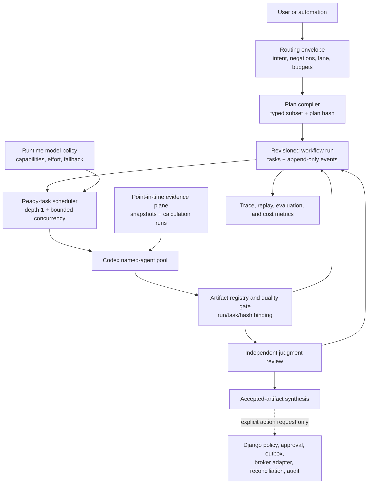

# TradingCodex Improvement Assessment And Roadmap

- Assessment date: 2026-07-10
- Assessed revision: `089fbb3075d11d0effdafe6aceb6049a36622217` (`main`)
- Assessment type: source, documentation, generated-workspace, test, and targeted local-runtime review

This is a point-in-time engineering assessment, not a replacement for the
product contracts in the other documents under `docs/`. Verified behavior is
separated from inferred impact. Proposed changes still require focused design,
tests, documentation updates, and release review.

## Executive Assessment

TradingCodex has a strong product foundation: a local-first Django service
plane, explicit role separation, service-gated execution, generated Codex
workspaces, file-native research, and unusually detailed safety documentation.
The current source also passes its existing test and doctor suites.

However, the assessed revision did not enforce several of its most important
contracts. The highest-risk findings allowed a caller to supply a minimal forged
approval receipt, self-assert a privileged role, persist raw secret values, or
expand a research workflow into an execution lane. A broker status operation
advertised as read-only could also promote a connection to `trading_enabled`.
These are invariant failures, not polish issues.

The release posture recommended at assessment time was:

- Do not treat the current revision as suitable for live-capable operation.
- Keep live execution disabled while the P0 findings are open.
- Block the next release until approval provenance, caller identity, secret
  handling, workflow scope, broker status semantics, audit durability, and
  version consistency have regression coverage.
- If `0.3.6` is already immutable on PyPI, fix these items in the next patch
  release rather than attempting to replace the published artifact.

The built-in paper-only default and the remaining live gates reduce immediate
external-market impact. They do not remove the need to fix paper-state
integrity, secret leakage, or authorization semantics.

The GPT-5.6/Codex update was an opportunity to improve reasoning quality and
cost, but it does not supersede those blockers. The assessed revision hard-coded
all fixed roles to GPT-5.5/high, coupled concurrency to roster size, and lacked a
model-upgrade evaluation/rollback layer. Its forecast, scenario, source, and
anti-overfit vocabulary is promising, but most controls validate artifact shape
rather than point-in-time data, experiment results, resolution, calibration, or
attribution. The proposed strategic path is therefore: secure the invariants,
introduce capability-discovered model policy, consolidate the workflow state
machine, and then make investment quality empirically measurable.

## Implementation Status

This section tracks the implementation that followed the assessment. The
evidence and line references in the finding sections below describe the audited
starting point; they are intentionally retained as the reason each change was
made. Status means:

- **Implemented**: the proposal's executable core exists for the currently
  supported product scope.
- **Interim**: a material executable slice exists, but one or more stated exit
  criteria or rollout activities remain.
- **Deferred**: the proposal remains design guidance and is not an active
  product capability.

This is a capability ledger, not a substitute for the release validation record
or the final real-Codex smoke.

| Item | Status | Current implementation boundary |
| --- | --- | --- |
| TCX-001 | **Implemented** | Submission rejects inline/path receipts, resolves the DB-canonical receipt linked to an `APPROVED` ticket, validates exact hash/scope/limits/expiry, locks and reserves transactionally, and consumes the receipt. |
| TCX-002 | **Interim** | Role-specific stdio binds `TRADINGCODEX_MCP_PRINCIPAL`, rejects payload-role mismatch/omission, and HTTP mutations require API/session authentication. A general one-time consent-nonce subsystem is not introduced. |
| TCX-003 | **Implemented** | External MCP launch config accepts reference-only env/keychain forms, resolves env values only at launch, recursively redacts persisted/output/log data, rotates stderr, and includes a legacy-row scrub migration. Previously exposed credentials still require operator rotation. |
| TCX-004 | **Implemented** | Broker status inspection is pure; execution-scope enablement is separated from read-only status. |
| TCX-005 | **Implemented** | Typed lanes, structured intent, immutable routing envelopes, strict plan subsets, run-id binding, budget/role/DAG validation, and artifact-gated `SubagentStop` behavior are enforced. |
| TCX-006 | **Interim** | Mandatory audit plus intent/idempotency reservation commit before provider invocation; uncertain outcomes become `NEEDS_REVIEW` with correlation data; AuditEvent is append-only/read-only in Admin. A general background outbox/saga worker for every optional projection remains future work. |
| TCX-007 | **Implemented** | Package metadata reads one runtime version source; CI and release install and smoke the clean wheel. |
| TCX-008 | **Implemented** | `discard_draft_order` and `cancel_submitted_order` have separate roles, states, policy/approval, broker, confirmation, idempotency, and audit contracts. |
| TCX-009 | **Implemented** | Six-decimal money fields carry native/base currency, point-in-time FX, and source ids; paper state uses currency cash buckets plus versioned transactional compare-and-swap. The active profile selects a validated three-letter base currency, ambiguous boundaries fail closed, and forward migrations preserve legacy meaning without making it the current default. |
| TCX-010 | **Interim** | Runtime column synthesis was removed and migration/lock failures are explicit. MCP registry failure now exposes only a fixed static safe-read subset; other broad optional fallbacks still need contract-by-contract removal. |
| TCX-011 | **Implemented** | Research writes are serialized, atomically replaced, content-hash CAS protected, and prior versions are archived under `.versions/`. |
| TCX-012 | **Interim** | A language-neutral intent schema and conservative unsupported-language guard exist. A reviewed multilingual classifier/localization adapter and broad adversarial corpus are not bundled into ordinary routing. |
| TCX-013 | **Deferred** | Role TOML, MCP allowlists, transport identity, and deny rules remain layered controls, but filesystem policy is still denylist-oriented; role-by-role real Codex default-deny smokes remain required. |
| TCX-014 | **Implemented** | New workspaces start on workspace-id-derived isolated profiles; shared state requires explicit selection and displays a persistent web warning. |
| TCX-015 | **Interim** | Workflow contracts/state, forecasting, ResearchSpec, causal analysis, evaluation, health, runtime profile, and log safety were split into focused modules. The largest legacy application/interface modules still need use-case extraction and dependency cleanup. |
| TCX-016 | **Interim** | P0/P1 invariant tests and a single clean-wheel package-smoke job were added. Marker-based fast/nightly partitions, incremental lint/type/security gates, coverage policy, and protected real-Codex/concurrency jobs remain future work. |
| TCX-017 | **Implemented** | Liveness/readiness are distinct; readiness checks DB/migrations/state writeability; autostart/doctor consume it; logs rotate/redact; local/remote profiles fail closed at their documented boundaries. |
| TCX-018 | **Interim** | Research list/search uses a rebuildable incremental workspace index and the installation example is file-native. Formal 1,000/10,000-artifact latency budgets are not yet part of CI. |
| TCX-019 | **Implemented** | Registry-owned Sol/Terra/Luna policies project role TOML and a model-policy manifest with fallback, capability, revision, rollout, and support status. Unprobed runtimes are reported as `unverified`. |
| TCX-020 | **Interim** | One-switch GPT-5.5 rollback and a frozen control/candidate evaluation service exist. Actual baseline measurement, canary operation, and promotion remain release activities rather than assumed outcomes. |
| TCX-021 | **Deferred** | Existing compact briefs/context audits remain, but measured GPT-5.6 prompt-prefix consolidation, stage-specific root tool projection, and token/cache budget enforcement are not implemented. |
| TCX-022 | **Deferred** | API-only persisted reasoning, PTC, Responses multi-agent, Pro/max effort, and row fan-out are intentionally not projected into Codex or execution paths. |
| TCX-023 | **Implemented** | Plans compile against typed, hash-bound routing envelopes with strict fields, role matrix, monotonic blocked scope, DAG checks, and budgets. |
| TCX-024 | **Interim** | One serialized revision reducer and replayable per-run event stream now own workspace state. Django-canonical workflow events and a dual-read DB cutover are not part of this implementation. |
| TCX-025 | **Implemented** | Artifact gates require exact run/plan/stage/task, producer/schema/content/input/source bindings before automatic downstream acceptance. |
| TCX-026 | **Interim** | Ten registered roles are decoupled from a six-thread scheduler, depth remains one, and routing envelopes bound task/round/concurrency budgets. Runtime token/cost/elapsed limits are not hard scheduler inputs. |
| TCX-027 | **Interim** | Workflow state is evented, revisioned, idempotent, hash-checked, and replayable. Full dispatch/tool/token/cache/cost telemetry is not universally available. |
| TCX-028 | **Implemented** | Immutable ResearchSpec, content-addressed PIT snapshots, cutoff-checked replay manifests, and CLI/API/MCP surfaces are active and evidence-only. |
| TCX-029 | **Implemented** | Listed-equity specs require causal driver/base-rate/scenario plans; deterministic Decimal reverse/forward DCF and method reconciliation are paired with blind prior and second-pass judgment review. Unsupported instruments remain outside this engine. |
| TCX-030 | **Implemented** | Immutable ExperimentRun binds spec/replay/code/data/config/model/tool hashes and requires evidence-backed checks for every method profile. `quant_signal_v1` additionally enforces the cumulative preregistered trial budget, fixed anti-overfit checks, and restricted conclusions; all-NA checks cannot support `conditionally_promising`, and Validation Cards cannot call `not_assessed` evidence validated. External numerical engines still own domain calculations. |
| TCX-031 | **Implemented** | Application/CLI/API/MCP issue, revise, independently resolve, dispute-recover, score, list/get, and calibration operations use locked immutable events, monotonic cutoff/horizon checks, proper target-specific scores where elicitable, explicit range-only diagnostics, base-rate comparison, and sample-gated stratification. |
| TCX-032 | **Interim** | A frozen research-only corpus/run/blind-review/comparison service and CLI/API/MCP surfaces enforce required case classes, deterministic check shape, hard-failure mapping, promotion criteria, and human non-inferiority review. Run environment digests and check truth are currently caller-attested; comparison records them as unverified and forces `hold` until trusted-runner provenance exists. |
| TCX-033 | **Implemented** | Core, bundled capability, and user-overlay boundaries are explicit in prompts, projection metadata, exact-path doctor checks, non-implicit user skill metadata, and host-global collision diagnostics. The managed inventory is deliberately not presented as hard runtime-wide skill isolation. |
| TCX-034 | **Interim** | Pristine research now has bundled method profiles, live public web access, scoreable forecast operations, and profile-based frozen evaluation. A populated clean-host versus populated-host corpus, resolved forecast history, and paired quality evidence are still required before claiming exceptional or calibrated pristine performance. |

### Implementation Validation Record

Validation completed on 2026-07-10 against the final uncommitted working tree:

- `python -m pytest`: 172 passed in 98.21 seconds, with three upstream Pydantic deprecation warnings.
- `python manage.py check`: passed.
- `python manage.py makemigrations --check --dry-run`: no changes detected.
- `python -m compileall -q tradingcodex_cli tradingcodex_service apps tests`: passed.
- clean generated workspace: full, `codex-native`, and `improvement` doctor layers passed; hook routing preserved `no order`, `no trading`, and `no valuation`; MCP `tools/list` passed.
- clean distribution: sdist/wheel build, Twine metadata check, isolated wheel install, workspace attach, and final-wheel `codex-native`/`improvement` doctor layers passed.
- rollback: regenerating with `TRADINGCODEX_MODEL_ROLLOUT=rollback` projected every role to the GPT-5.5 control and passed the Codex-native doctor layer.
- real populated-host Codex CLI smoke: Codex `0.144.0-alpha.4` loaded
  `gpt-5.6-sol`, loaded the TradingCodex head-manager instructions, ignored an
  adversarial host-global investment sentinel, selected only
  `fundamental-analyst`, `technical-analyst`, `news-analyst`, and
  `judgment-reviewer`, selected `general_evidence_v1` with conditional
  `event_research_v1`, recorded the hash-bound plan, and stopped at
  `waiting_for_subagent_dispatch` without dispatch, investment analysis,
  valuation, trading, or order work.

The real client reported `xhigh` reasoning even though the generated project
policy declares `high`, consumed 50,933 tokens while locating and recording the
plan, and encountered a pre-existing local `0.3.5` service on port 48267 plus an
MCP shutdown handshake warning. The file-native plan smoke passed, but this run
does not attest the live MCP path, prompt efficiency, or requested reasoning
level. One adversarial sentinel pass also does not prove hard runtime isolation
from every host skill. Terra/Luna canaries, clean-versus-populated host
equivalence, trusted-runner provenance, the frozen GPT-5.5/GPT-5.6 corpus, and
blind non-inferiority review therefore remain interim.

## Validation Baseline

The assessment observed the following baseline:

| Check | Result |
| --- | --- |
| `python -m pytest` | 95 passed, 3 dependency deprecation warnings, 103.92 seconds |
| `python manage.py check` | Passed |
| `python manage.py makemigrations --check --dry-run` | No changes detected |
| `python -m compileall -q tradingcodex_cli tradingcodex_service apps tests` | Passed |
| Clean generated workspace and `./tcx doctor` | Passed with two expected not-yet-started warnings |
| `python manage.py check --deploy` | Six warnings, including the development secret key and `DEBUG=True` |

The generated-workspace smoke also exposed a release inconsistency: doctor
passed, but `.tradingcodex/generated/module-lock.json` recorded `0.3.5` while
`pyproject.toml` declares `0.3.6`.

Targeted checks in isolated temporary homes/workspaces reproduced these
behaviors:

- A DRAFT paper ticket plus a minimal caller-supplied approval object was
  accepted for execution. The forged receipt and an `ExecutionResult` were
  stored while the ticket remained DRAFT.
- A raw secret canary supplied in an External MCP `env` object appeared in both
  `McpRouter.env` and the `McpToolCall.request` ledger.
- A thesis-review intake accepted a plan widened to the approval/execution lane,
  and a made-up lane name also passed validation.
- An unsupported-language investment request and its order/trading negations
  were not recognized by the deterministic router, while the equivalent
  default-language request was recognized correctly.

Passing tests do not contradict these findings. Several behaviors are not
covered, and some current tests explicitly expect status checks to promote a
broker connection or omit the execution principal and let the runtime choose
one.

## Priority Definitions

| Priority | Meaning |
| --- | --- |
| P0 | Release blocker or executable safety invariant failure. Contain immediately and fix before live-capable use. |
| P1 | Correctness, isolation, or reliability gap that should be addressed in the next focused hardening cycle. |
| P2 | Scalability, maintainability, test-speed, documentation, or operational improvement. |

## P0: Release-Blocking Findings

### TCX-001 — Submission accepts non-canonical, incomplete approval receipts

Verified evidence:

- `tradingcodex_service/mcp_runtime.py:111-133` requires only receipt id,
  ticket id, approver, validity, and expiry. Exact order hash and broker/account
  scope are optional.
- `tradingcodex_service/mcp_runtime.py:236-252` permits an inline receipt, a
  workspace receipt path, or a receipt id during submission.
- `tradingcodex_service/application/orders.py:75-117` compares order hash and
  scope only when those optional fields are present.
- `tradingcodex_service/application/orders.py:1291-1303` prefers a caller-supplied
  receipt dictionary over the central DB record.
- The isolated reproduction accepted the order, persisted the forged receipt,
  created an execution result, and left the ticket in DRAFT.

Impact: the documented exact-payload, DB-canonical approval boundary can be
bypassed. Ticket state, approval state, and execution state can then disagree.

Recommended change:

1. Remove inline and file-path receipts from `submit_approved_order`.
2. Accept only a central DB receipt id, or resolve the active immutable receipt
   from the ticket under a transaction.
3. Require exact order hash, broker connection, broker account, order type,
   time-in-force, limits, expiry, and an approved ticket state.
4. Add an immutable relation from the receipt to the order ticket and consume or
   supersede receipts explicitly.
5. Reject submission unless the ticket is `APPROVED`; do not swallow transition
   failures.

Completion criteria:

- Minimal, missing-hash, payload-mismatched, path-based, inline, expired, and
  revoked receipts all fail before adapter invocation.
- A DRAFT/PRECHECKED ticket cannot create an `ExecutionResult`.
- Receipt validation and execution reservation occur in one consistent DB
  boundary.

### TCX-002 — Privileged requester identity is self-asserted

Verified evidence:

- `tradingcodex_service/application/common.py:109-119` treats any loopback
  request as local without authenticating the caller.
- API request schemas expose caller-controlled defaults such as
  `principal_id="risk-manager"` and `principal_id="execution-operator"` in
  `tradingcodex_service/api.py:141-191`.
- `tradingcodex_service/mcp_runtime.py:870-883` accepts `principal_id` from tool
  arguments, and `:990-997` chooses an allowed privileged principal when it is
  omitted.
- Stdio `tools/call` has no separate immutable caller context
  (`tradingcodex_service/mcp_runtime.py:1139-1143`).
- Existing tests submit approved orders without a principal at
  `tests/test_python_migration.py:3103-3104` and `:5727-5728`.

Impact: role projection is a useful UX boundary but not a server-side identity
proof. Another process under the same local user, a direct loopback client, or a
manually invoked stdio client can claim `risk-manager` or
`execution-operator`. The default loopback binding limits remote exposure but
does not solve local caller impersonation.

Recommended change:

1. Bind an immutable principal to the authenticated session, API token, Unix
   socket peer, or role-specific MCP server instance.
2. Remove `principal_id` from untrusted payloads, or reject any value that does
   not match the transport identity.
3. Require explicit authentication for every mutation, approval, cancellation,
   and execution endpoint even on loopback.
4. Keep direct human operations on a separate operator/admin path with explicit
   confirmation and audit provenance.
5. Bind user-consent decisions to a one-time nonce, origin, and interactive user
   action rather than a caller-supplied `principal_id="user"`.

Completion criteria:

- Anonymous loopback callers receive `401` or `403` on all mutations.
- Changing a request-body role never changes authorization.
- A role-specific MCP instance cannot call as another role, including when
  `principal_id` is omitted.

### TCX-003 — External MCP environment values breach the secret wall

Verified evidence:

- `tradingcodex_service/mcp_runtime.py:572-593` accepts an arbitrary `env`
  object for External MCP registration.
- `apps/mcp/services.py:75-103` stores those values directly in `McpRouter.env`.
- `apps/mcp/services.py:137-150` performs no secret rejection or reference-only
  conversion.
- `tradingcodex_service/mcp_runtime.py:892-906` passes the entire request to the
  MCP call ledger, whose request field is stored by
  `tradingcodex_service/mcp_runtime.py:1075-1105`.
- `apps/mcp/services.py:768-785` later copies stored values into the child
  process environment.
- The isolated canary appeared in both the router row and call-ledger row.

Impact: raw credentials can be persisted in clear text despite the documented
rule that only credential references may be stored. Existing deployments that
used this input may already contain secrets in the central DB and backups.

Recommended change:

1. Reject secret values at API, MCP, CLI, web, service, audit, and model
   boundaries; accept only environment variable names and `credential_ref`.
2. Resolve secrets only immediately before provider launch through a dedicated
   resolver that never returns values to response or audit code.
3. Apply one shared recursive secret detector/redactor before any request,
   response, audit, error, or log persistence.
4. Add a migration/maintenance command to scrub existing rows and advise users
   to rotate any credential that was previously supplied as a value.
5. Add canary tests for nested dictionaries, arrays, URLs, command arguments,
   errors, and child-process stderr.

Completion criteria:

- No canary value appears in SQLite, JSONL, service logs, MCP output, API output,
  or generated files.
- External MCP launch still works through a reference-only secret resolver.

### TCX-004 — A read-only broker status call can enable trading scopes

Verified evidence:

- `get_broker_connection_status` is an MCP `risk_level="read"` tool with a
  read-only hint (`tradingcodex_service/mcp_runtime.py:315-321`).
- REST exposes the same operation as `GET /api/brokers/{broker_id}`
  (`tradingcodex_service/api.py:544-546`).
- The service defaults `promote_execution` to true and calls the reconciliation
  mutator (`tradingcodex_service/application/brokers.py:1095-1103`).
- Successful health can set `status="trading_enabled"` and add trade scopes
  (`tradingcodex_service/application/brokers.py:1584-1604`).
- Current broker tests assert this promotion behavior.

Impact: a nominal read changes an execution-enabling gate. Other live gates
remain, so status inspection does not directly place an order, but the API
method, MCP risk annotation, user expectation, and actual side effects disagree.

Recommended change:

1. Make status inspection pure: it may calculate health but must not persist
   status, scope, credential-validation, or drift changes.
2. Introduce an explicit `validate_broker_connection` or `promote_broker_connection`
   mutation with a write capability, user-visible intent, and audit event.
3. Keep health refresh and execution enablement as separate steps.
4. Correct MCP standard hints and REST verbs for every state-changing operation.

Completion criteria:

- A DB snapshot is unchanged before and after every read-only tool and GET.
- Read-only connection -> status inspection -> read-only connection is a
  permanent regression test.

### TCX-005 — Workflow validation permits scope widening and arbitrary lanes

Verified evidence:

- `tradingcodex_service/application/workflow_planner.py:120-202` checks that a
  lane is non-empty but does not validate it against a canonical enum.
- It checks some explicit negations but does not enforce monotonic scope against
  the intake lane, a lane/role matrix, required judgment review, or explicit
  order/execution intent.
- The isolated check accepted both a thesis intake widened to
  `order_ticket_approval_execution_gate` and `lane="made_up_lane"`.
- The same validator accepted a `research_only` plan containing
  `valuation-analyst` and a 12-stage plan even though bounded task budgets are
  part of the surrounding loop policy.
- Runtime loop evaluation reclassifies a caller-supplied `original_request`
  instead of binding to the recorded plan
  (`tradingcodex_service/application/harness.py:320-341`), and the API request
  does not carry a workflow run id (`tradingcodex_service/api.py:203-206`,
  `:482-484`).
- A generated `SubagentStop` hook marks a stage complete and releases dependent
  stages before any artifact has passed the handoff gate
  (`workspace_templates/modules/codex-base/files/.codex/hooks/tradingcodex_hook.py:217-265`).

Impact: the control plane can validate and persist a plan that exceeds the
user's original scope. Service-layer execution gates still apply, but the
selected role team, workflow artifacts, and subsequent user experience can
already drift into approval or execution work.

Recommended change:

1. Define one typed lane enum and one reviewed lane-to-role/stage DAG matrix.
2. Bind plans to the intake id/hash and normalized intent.
3. Enforce monotonic scope: widening requires a new user-confirmed intake or a
   signed, expiring consent record.
4. Enforce required/forbidden roles, judgment-review gates, prerequisites, and
   blocked actions, stage count, and task budgets per lane.
5. Reject unknown fields and unknown lanes rather than treating them as future
   compatibility.
6. Resolve every loop operation by `workflow_run_id` and its immutable recorded
   plan. A raw request may create a new intake, but it must not silently replace
   the active run contract.
7. Treat `SubagentStop` only as process completion. Release a dependent stage
   only after the required artifact exists and is `accepted`; otherwise retain
   `waiting`, `revise`, or `blocked`.

Completion criteria:

- Unknown lanes, unauthorized roles, missing required roles, and scope widening
  all fail deterministic validation.
- Adversarial plan tests cover research -> portfolio, portfolio -> order, and
  order -> execution escalation.
- A stopped subagent without an accepted artifact cannot complete its stage or
  unblock a dependent role.

### TCX-006 — Audit and external-effect recovery are best-effort

Verified evidence:

- Adapter submission occurs before final receipt persistence, execution
  finalization, ticket/fill/ledger updates, and audit
  (`tradingcodex_service/application/orders.py:244-295`).
- Only the initial execution reservation is atomic
  (`apps/orders/services.py:58-107`).
- DB audit failures are swallowed, while the caller is still told
  `written=True` and `db_canonical=True`
  (`tradingcodex_service/application/audit.py:9-48`).
- MCP ledger failures are also swallowed
  (`tradingcodex_service/mcp_runtime.py:1075-1105`).
- `AuditEvent` is registered with the default editable/deletable Admin
  (`apps/audit/admin.py:1-6`) despite being documented as append-only.

Impact: a provider may accept an order while local state remains `pending` or
partially written. A retry is then blocked by the existing reservation, and the
central audit row may be absent or later modified. This is especially dangerous
at the uncertain-submit boundary.

Recommended change:

1. Commit an execution intent, idempotency reservation, and audit/outbox record
   in one DB transaction before invoking a provider.
2. After the provider call, durably finalize `accepted`, `rejected`, or
   `needs_review` with broker/client order ids before optional projections.
3. Move ticket, fill, portfolio, and audit projection into retryable saga steps
   with explicit reconciliation state.
4. Fail before provider invocation when the mandatory durable sink is
   unavailable.
5. Make Audit Admin read-only and prohibit update/delete through service and
   model policy. Consider hash chaining or signed export for tamper evidence.

Completion criteria:

- Fault injection at every post-provider write point yields a recoverable
  `needs_review` record with broker correlation ids.
- Audit-sink failure prevents connector invocation.
- Audit records cannot be edited or deleted through supported surfaces.

### TCX-007 — Release version sources disagree and release jobs do not install the wheel

Verified evidence:

- `pyproject.toml:7` declares `0.3.6`.
- `tradingcodex_service/version.py:1` declares `0.3.5`.
- Generator, startup, service compatibility, API, and MCP behavior import the
  runtime constant.
- A clean workspace generated by this revision recorded `0.3.5`, while doctor
  passed.
- `.github/workflows/release.yml:57-78` tests editable source, builds, and runs
  `twine check`, but does not install and execute the built wheel.
- The clean-wheel install is required by `docs/deployment.md:71-81` and
  `docs/validation-and-test-plan.md:317-322`.

Impact: a `0.3.6` distribution can identify itself and its generated workspaces
as `0.3.5`, causing false update or compatibility decisions. Packaging, entry
point, template, and wheel-data defects can escape the release workflow.

Recommended change:

1. Use one version source, either PEP 621 dynamic metadata from a small version
   module or `importlib.metadata.version("tradingcodex")` with a source-tree
   fallback.
2. Add a release assertion that wheel metadata, runtime API/MCP version,
   generated `module-lock.json`, and documented release version match.
3. Install the built wheel in a fresh environment and run `tcx attach`, doctor,
   migration, and MCP `tools/list` before publication.
4. Make doctor fail on package/runtime/generated version disagreement.

Completion criteria:

- One edit changes the version everywhere.
- The release job tests only the built artifact for its final smoke.

## P1: Correctness, Isolation, And Reliability

### TCX-008 — Cancellation mixes draft discard with approved broker cancellation

`cancel_approved_order` permits DRAFT -> CANCELED and does not re-run policy or
approval validation before a live provider cancel
(`tradingcodex_service/application/orders.py:638-760`). The MCP annotation says
approval is required, but service code does not enforce that requirement.

Split the use cases:

- `discard_draft_order`: portfolio-manager-only, local, DRAFT/PRECHECKED only.
- `cancel_submitted_order`: execution-operator-only, known broker order,
  cancelable submitted state, DB-canonical approval or cancel-specific approval,
  immediate policy/connection/live-confirmation checks, idempotency, and audit.

Add tests proving execution-operator cannot destroy an unapproved portfolio
draft and a stale/revoked approval cannot authorize provider cancellation.

### TCX-009 — Currency and paper-portfolio arithmetic are not financially safe

`create_order_ticket` originally stored `quantity * limit_price` as a base
notional without applying FX. Policy then compared that native-currency number
with a limit denominated in a different currency. A large foreign-currency
order could therefore be evaluated as the same nominal amount in the profile's
base currency.

The paper portfolio also converts quantities, prices, positions, and cash to
`float`, reads the latest snapshot, mutates it in memory, then writes a new
snapshot without a profile lock or encompassing transaction
(`tradingcodex_service/application/portfolio.py:14-38`, `:74-161`). Concurrent
orders can read the same cash and overwrite each other's state; partial child
rows can remain after a failure.

Recommended change:

- Introduce a `Money`/notional contract with native currency, base currency,
  FX rate, source snapshot id, and as-of time.
- Fail approval when FX is missing, ambiguous, or stale; support native-currency
  limits in addition to base-currency limits.
- Keep `Decimal` end to end.
- Serialize paper updates per `(portfolio_id, account_id, strategy_id)` using a
  versioned current-state row, lock, or compare-and-swap, and write snapshots and
  child rows inside `transaction.atomic()`.
- Add concurrent-buy, concurrent-sell, partial-failure, USD, JPY, and FX-staleness
  tests.

### TCX-010 — Runtime schema management and broad exception handling hide failures

Runtime startup automatically runs migrations and then manually adds any
missing model columns (`tradingcodex_service/application/runtime.py:248-341`).
The schema-repair helper, file-lock failures, workspace-context persistence,
audit persistence, and many other paths silently swallow broad exceptions. The
audit counted 103 broad `except` clauses and 76 broad handlers that silently
pass or return fallback values across CLI/service/apps code.

One safety-relevant example is the MCP registry: registry synchronization
failure is ignored and `tool_enabled` returns true when its DB lookup fails
(`tradingcodex_service/mcp_runtime.py:782-801`, `:848-857`). Capability and
policy checks still provide additional gates, but the operator's explicit
disabled-tool control becomes fail-open.

This makes a local tool appear resilient, but it blurs three materially
different states: optional telemetry unavailable, canonical state unavailable,
and safety enforcement unavailable.

Recommended change:

- Remove runtime column synthesis after Django migrations. Fail startup with a
  specific migration error and recovery command.
- Keep automatic migration only as an explicit, observable startup phase with a
  migration lock whose acquisition failure is fatal.
- Define error classes and a policy matrix: fail closed for identity, policy,
  approval, execution, secrets, audit, and canonical state; degrade only for
  genuinely optional UI/telemetry data.
- On registry failure, expose only an explicit static safe-read subset; treat
  every write, approval, broker, policy, and execution tool as unavailable.
- Add structured logs and reason codes instead of empty fallbacks.

### TCX-011 — File-native research lacks concurrency control and durable history

Research creation reads the current artifact/version and writes directly to the
same path with `write_text` (`tradingcodex_service/application/research.py:46-103`).
Append reads the same file and re-enters the same write path (`:119-136`). There
is no per-artifact lock, expected-version/hash compare, atomic replace, or
immutable old-version file. The frontmatter version increments, but previous
content is overwritten even though product docs describe version history.

Recommended change:

- Lock by workspace + artifact id, re-read under lock, and require an
  `expected_version` or `expected_content_hash` compare-and-swap.
- Write to a temporary file, fsync as appropriate, and atomically replace the
  current pointer.
- Preserve immutable versions under a reviewable workspace path while keeping a
  stable latest artifact path.
- Add two-writer lost-update tests, interrupted-write tests, and old-version
  retrieval/export tests.

### TCX-012 — Deterministic routing lacks a language-adapter boundary

The investment, connector, secret, intent, and negation classifiers use
default-language regular expressions
(`tradingcodex_service/application/workflow_routing.py:10-159` and `:819-977`;
`tradingcodex_service/application/workflow_planner.py:283-302`). In the isolated
check, an unsupported-language investment prompt was not a workflow candidate
and its order/trading negations were not recognized.

This conflicts with the product's user-language artifact posture and is a
safety issue when a negation is missed. Do not solve it by adding scattered
language-specific keyword lists, which would violate the repository's
localization rule.

Recommended change:

- Define a language-neutral structured intent schema with explicit requested,
  forbidden, and unresolved actions.
- Add a reviewed localization/classification boundary that produces that schema,
  then validate it deterministically.
- For an unsupported or low-confidence language, fail to research-only or ask
  for confirmation; never infer order/approval/execution intent.
- Build multilingual adversarial fixtures, especially negations and mixed-language
  ticker prompts.

### TCX-013 — Role filesystem isolation is an incomplete denylist

Generated role profiles inherit broad workspace access and then deny selected
other-role, approval, order, audit, and policy paths
(`workspace_templates/modules/codex-base/files/.codex/config.toml:47-116`).
Role TOML claims a narrower “own artifact only” contract, but control-plane
paths such as `.codex/**`, `.agents/**`, source files, and several out-of-role
artifact paths are not comprehensively denied. Doctor checks file presence and
configuration strings rather than attempting prohibited reads/writes.

Recommended change:

- Use role-specific default-deny profiles with explicit read roots and one or a
  small number of owned write roots.
- Make `.codex`, `.agents`, protected `.tradingcodex` control state, policies,
  approvals, audit, and source code read-only or invisible to investment roles.
- Add real Codex-native denial smokes for each role instead of static TOML checks
  alone.

### TCX-014 — Shared default profiles make cross-workspace state surprising

The default active profile is explicitly the shared central paper profile
(`tradingcodex_service/application/runtime.py:27-36`), and all workspaces share
orders, approvals, executions, broker state, audit, and portfolio records unless
the operator selects another DB/profile (`docs/system-architecture.md:120-135`).
This is intentional architecture, but new workspaces start on the same
`default-paper / local-paper / default-strategy` state.

Keep the central ledger, but make sharing an explicit choice:

- Create an isolated paper profile during attach/onboarding, or require the user
  to select “shared” versus “isolated”.
- Display a persistent shared-profile banner on order, approval, portfolio, and
  broker surfaces.
- Require profile confirmation for cross-workspace ticket actions.
- Add tests that a fresh workspace cannot accidentally operate another
  workspace's default draft without an explicit shared-profile decision.

## P2: Scale, Maintainability, And Operations

### TCX-015 — Module and dependency boundaries are becoming difficult to maintain

Several modules combine too many use cases: `application/harness.py` is about
1,943 lines, `application/agents.py` about 1,854, `application/brokers.py` about
1,806, `application/orders.py` about 1,432, `web.py` about 1,425, and
`application/workflow_routing.py` about 1,333.

The dependency direction also crosses the documented boundary:

- application harness imports MCP runtime
  (`tradingcodex_service/application/harness.py:24`, `:1726`);
- MCP runtime imports CLI startup status
  (`tradingcodex_service/mcp_runtime.py:932-935`);
- web imports CLI generator and startup logic
  (`tradingcodex_service/web.py:15`, `:86`).

Refactor by durable use case, not by adding services or frameworks. Extract
small application modules for tool metadata, workspace bootstrap, update status,
broker lifecycle, execution saga, and artifact storage. Keep Web/API/MCP/CLI as
inward-calling adapters.

### TCX-016 — Test and release automation are broad but not risk-shaped

Of 95 tests, 79 live in the 5,743-line `tests/test_python_migration.py`. The full
suite takes about 104 seconds locally and is repeated on four Python versions;
build/twine work is also repeated per matrix job. CI has no clean-wheel runtime
smoke, real Codex smoke, coverage threshold, static type/lint gate, dependency
audit, or concurrency stress suite.

Recommended change:

- Split unit, application, API, MCP, generator, package, and end-to-end tests and
  add pytest markers.
- Run a fast PR gate, one package-build/wheel-smoke job, a supported-Python test
  matrix, and protected nightly/manual Codex and concurrency smokes.
- Add release-blocking negative tests for every P0 invariant.
- Add CI concurrency cancellation for superseded branch runs.
- Introduce lint/type/security tools incrementally around safety-critical modules
  first rather than requiring an all-at-once cleanup.

### TCX-017 — Health, logging, and remote-mode posture need explicit contracts

`/api/health` returns static process/version/path data without checking DB
readiness, migrations, locks, or writeability
(`tradingcodex_service/api.py:274-284`), yet service compatibility trusts it
(`tradingcodex_cli/service_autostart.py:171-223`). The background service appends
forever to one `service.log` (`tradingcodex_cli/service_autostart.py:133-153`).
The default settings use a development secret and `DEBUG=True`
(`tradingcodex_service/settings.py:21-23`); this is acceptable only while the
service remains strictly local and must not silently become a remote profile.

Recommended change:

- Split `/health/live` from `/health/ready`; readiness should check DB access,
  migration state, mandatory state-directory writeability, and reason codes.
- Make autostart and doctor depend on readiness, not static identity.
- Rotate/redact service and external-MCP logs and expose path, size, and recent
  error state through `tcx service status/logs`.
- Add explicit `local` and future `remote` settings profiles. Refuse non-loopback
  binding unless secure key, `DEBUG=False`, authenticated mutations, allowed
  hosts/origins, and transport security are configured.

### TCX-018 — Research search and operator documentation will degrade with scale

Research list/search walks every markdown file, reparses frontmatter, reads full
bodies, and recomputes hashes before filtering and limiting
(`tradingcodex_service/application/research.py:151-194`, `:358-440`). This is
linear in the full archive and has no benchmark budget.

Keep files as the source of truth, but add an incremental workspace index keyed
by path, mtime, size, and content hash. Search metadata first and load only
candidate bodies. Add 1,000- and 10,000-artifact latency benchmarks and rebuild
the index safely when stale.

The installation smoke also calls research “DB-backed” and passes a root-level
`note.md` that the allowed-root checks reject (`installation.md:141-147`). Update
the example to create a file under `trading/research/`, describe research as
workspace-file-native, and execute documentation command blocks in CI. Review
remaining `0.2.0` contract wording so current `0.3.x` users can distinguish
historical compatibility notes from active contracts.

## GPT-5.6 And Current Codex Readiness

### Evidence boundary as of 2026-07-10

The model update must be separated into API facts, Codex client capabilities,
and TradingCodex product choices:

| Layer | Verified current state | TradingCodex implication |
| --- | --- | --- |
| OpenAI API | The official [GPT-5.6 guide](https://developers.openai.com/api/docs/guides/latest-model) identifies `gpt-5.6-sol` as the frontier model and says the `gpt-5.6` alias routes to Sol. It describes Sol, Terra, and Luna roles, broader reasoning controls, Pro mode, explicit caching, persisted reasoning, Programmatic Tool Calling (PTC), and a Responses API multi-agent beta. | These are API capabilities, not automatically valid project-TOML keys or Codex model selectors. |
| Migration and prompting | The official [migration guide](https://developers.openai.com/api/docs/guides/upgrading-to-gpt-5p6-sol) and [prompt guide](https://developers.openai.com/api/docs/guides/prompt-guidance-gpt-5p6) recommend inventorying each use, preserving the existing reasoning baseline, testing the same effort and one lower effort, simplifying prompts and tool sets, and treating optional features as separate experiments. | A model-string replacement is not a sufficient migration. Prompt, tool, state, parser, cache, and evaluation behavior need independent comparison. |
| Codex | The official [subagent guide](https://developers.openai.com/codex/subagents) says subagent workflows are enabled by default, named agents may use different model/reasoning settings, depth one is the normal posture, and concurrency/runtime controls are available. The [config reference](https://developers.openai.com/codex/config-reference) documents the current project configuration surface. | Keep named fixed roles and `max_depth = 1`, but discover the installed client's exact model and config support before rendering new settings. |
| Unverified in the fetched Codex pages | The fetched Codex pages do not establish that every installed Codex client accepts `gpt-5.6-sol`, Terra/Luna selectors, API `max` effort, Pro mode, persisted-reasoning, explicit-cache, PTC, or Responses multi-agent settings in project TOML. | Report these as `verified`, `unsupported`, or `unverified`; never silently assume API/Codex parity. |

TradingCodex currently has no OpenAI SDK dependency
(`pyproject.toml:29-35`). It is a Codex-native harness, so it should not add a
direct Responses API runtime merely to claim GPT-5.6 support. API-only features
belong in a later, feature-flagged adapter if they solve a measured use case.

### Audited starting posture (superseded by the status ledger)

The bullets in this subsection describe the assessed revision before the
implementation above. See **Implementation Status** for the current tree.

- All ten fixed agent files pin `model = "gpt-5.5"` and
  `model_reasoning_effort = "high"`
  (`workspace_templates/modules/fixed-subagents/files/.codex/agents/*.toml:4-5`).
- The generated-workspace test asserts those exact literals
  (`tests/test_python_migration.py:1517-1526`), and durable docs repeat them
  (`docs/generated-workspaces.md:157`,
  `docs/roles-skills-and-workflows.md:407`).
- `AgentSpec` has no model policy, fallback, capability, prompt revision, or
  rollout metadata (`tradingcodex_service/application/agents.py:27-35`).
- Generated `agents.max_threads` equals the total roster while
  `max_depth = 1`
  (`workspace_templates/modules/codex-base/files/.codex/config.toml:12-14`),
  and doctor requires that coupling
  (`tradingcodex_cli/commands/doctor.py:52-64`).
- The head-manager receives 36 enabled MCP tools across several planes
  (`tradingcodex_service/application/agents.py:88-126`). Role tool sets are
  narrower, which is the better default.
- The 191-line head-manager prompt and ten role TOMLs already contain good
  context and safety rules, but repeat instruction-preservation, claim, and
  external-source prose that should be tested for consolidation rather than
  copied into a GPT-5.6-specific prompt.

### TCX-019 — Replace literal model pins with a capability-aware runtime policy

Priority: P1 before changing the default model.

Add one registry-owned, file-projected model policy. Each resolved role policy
should record:

- runtime surface and minimum compatible Codex version;
- primary model selector and allowlisted fallback;
- reasoning baseline and permitted downgrade/upgrade range;
- required capabilities and known unsupported settings;
- prompt revision, tool-profile revision, rollout cohort, and rollback target;
- whether the configuration is `verified`, `unsupported`, or `unverified`
  on the installed client.

Generate role TOML from that policy and include the resolved result in
`.tradingcodex/generated/skill-index.json` or a dedicated
`model-policy-manifest.json`. Tests should validate registry-to-projection
consistency, not freeze one model literal forever. Model selection belongs in
the registry/generator, never in a skill body, and it must not change role
eligibility, permissions, MCP allowlists, approval authority, or execution
authority.

A candidate role policy, subject to actual Codex support and paired evaluation,
is:

| Work class | Candidate model posture | Initial reasoning comparison |
| --- | --- | --- |
| Difficult synthesis, valuation challenge, and independent judgment | Frontier/Sol class | Current `high` baseline, then one lower effort; use higher modes only when the task proves to need them. |
| Routine evidence analysis and ordinary workflow coordination | Balanced/Terra class when exposed by the runtime | Same-quality lower-cost effort selected by evaluation, not by assumption. |
| Deterministic extraction, normalization, metadata, and batch QC | Efficient/Luna class when exposed, or Python services | Low effort; prefer deterministic application code when semantics are not required. |
| Approval/execution operator | Lowest compatible model that is reliably tool-correct | Keep reasoning bounded because canonical policy and execution decisions remain deterministic service work. |

Keep GPT-5.5/high as the rollback control until a real Codex smoke proves the
candidate selector and each required permission/tool behavior.

### TCX-020 — Make the GPT-5.6 migration an evaluation and rollback program

Priority: P1, in parallel with hardening but never ahead of the P0 invariants.

1. Inventory every model string, reasoning setting, prompt, tool list, parser,
   generated file, doctor check, test assertion, and UI/documentation label.
2. Freeze a representative research-only evaluation corpus and current
   GPT-5.5/high baseline.
3. Compare GPT-5.6 at the same reasoning effort with identical evidence, prompt,
   roles, tools, budgets, and deterministic calculations.
4. Only then compare one lower effort and role-specific model tiers.
5. Canary low-risk research roles first, then valuation and judgment. Move
   portfolio/risk only after decision-quality non-inferiority; migrate execution
   last.
6. Record model, effort, prompt/config/tool hashes, token usage, latency, cost,
   retries, tool errors, and experiment arm when the runtime exposes them.
7. Make rollback a single policy switch and regenerate, not ten manual TOML
   edits.

Do not combine a model change, prompt rewrite, tool-list rewrite, and scheduler
change in one experiment. Safety violations, scope widening, fabricated
evidence, or incorrect tool use are hard failures even if prose quality rises.

### TCX-021 — Simplify prompts and tool exposure with measured budgets

Priority: P2 after the like-for-like model comparison.

- Preserve role identity, explicit constraints, evidence requirements,
  completion criteria, and hard safety invariants in stable prompt prefixes.
- Move repeated procedural detail to on-demand role skills and keep changing
  task context at the tail. Use file-native shared fragments at source and
  render self-contained agent TOML with hashes; do not hide durable prompt text
  inside Python string constants.
- Project the smallest head-manager MCP tool set needed for the active
  operate/build/workflow stage while preserving defensive service checks.
- Measure the actual rendered starter and dispatch prompts. The current context
  audit reads a `starter_prompt` field that intake intentionally excludes
  (`tradingcodex_service/application/context_budget.py:35`, `:68-70`), so it
  does not reliably enforce the prompt built by
  `tradingcodex_service/application/harness.py:744-909`.
- Add prompt-size, tool-count, tokens, latency, and accepted-artifact quality to
  the evaluation report. Delete text only when paired tests preserve behavior.

Stable-prefix design also prepares a future API adapter for explicit cache use.
Do not claim cache savings unless cache-write/read tokens are actually exposed
and measured.

### TCX-022 — Adopt optional GPT-5.6 features behind explicit boundaries

Priority: P2, separate from baseline migration.

| Feature | Appropriate use | Prohibited or deferred use |
| --- | --- | --- |
| Persisted reasoning | A future API-backed task with the same role, stable objective, fixed data cutoff, and explicit reset rule. | Global research memory, cross-role transfer, independent judgment review, volatile market state, or approval/execution context. Stale reasoning can anchor later work. |
| PTC | Deterministic filter, join, rank, deduplicate, aggregate, or validate operations over already-authorized data. | Semantic source judgment, native citation selection, suitability, policy, approval, broker action, or execution. Existing Python services are preferable for durable control logic. |
| Responses multi-agent beta | A separately evaluated future runtime for cleanly parallel backend jobs. | Stacking a second scheduler underneath Codex subagents. TradingCodex should have one orchestration authority per run. |
| Pro mode or maximum API effort | Rare, quality-first offline challenge work after ordinary effort fails the acceptance bar. | Defaulting every role to the most expensive setting or assuming the Codex TOML surface exposes the API option. |
| CSV/row fan-out | Offline, row-independent enrichment or evaluation with a strict output schema. | Thesis synthesis, judgment, portfolio/risk, approval, or execution paths. |

## Harness V2 Target Architecture

This should be an incremental control-plane refactor, not a rewrite. Preserve the
current thesis—Codex coordinates, research remains inspectable, Django owns
durable decisions, and execution stays service-gated—while removing competing
state writers and untyped scope.

### TCX-023 — Compile plans against an immutable routing envelope

Priority: P1 and a direct continuation of TCX-005.

Create a typed routing envelope containing normalized intent, explicit
negations, permitted lane transitions, eligible/required/forbidden roles,
follow-up and escalation-only roles, blocked actions, required gates,
stage/task/iteration/concurrency budgets, terminal conditions, intake hash, and
routing-policy version.

Compile agent-authored plans as strict subsets of that envelope:

- reject unknown fields, lanes, roles, transitions, and later-stage
  dependencies;
- enforce a reviewed lane/stage DAG and judgment-review placement;
- enforce initial and loop task budgets;
- bind the compiled plan to its intake hash and immutable `plan_hash`;
- require new user consent and a new plan version for scope widening.

Pydantic is already a project dependency and can express these contracts.
Split normalization, lane policy, plan compilation, and loop policy into small
application modules instead of adding a new framework. This also removes the
current `workflow_planner -> harness` dependency
(`tradingcodex_service/application/workflow_planner.py:8-21`).

### TCX-024 — Use one revisioned run store and one transition reducer

Priority: P1.

Today the planner, application harness, and generated hook each perform
read-modify-write transitions
(`tradingcodex_service/application/workflow_planner.py:205-233`,
`tradingcodex_service/application/harness.py:73-125`, `:535-585`,
`workspace_templates/modules/codex-base/files/.codex/hooks/tradingcodex_hook.py:164-254`).
Generic JSON reads swallow malformed state and direct writes are not atomic
(`tradingcodex_service/application/common.py:28-43`).

Introduce one application-owned `RunStore` and transition reducer:

- target Django `WorkflowRun` plus append-only workflow events for
  transactional control state and use `ArtifactRef` for path/hash references;
- keep research bodies and source snapshots file-native;
- make per-run JSON under
  `.tradingcodex/mainagent/workflows/<workflow_run_id>/` inspectable
  projections, never independent authorities;
- include state revision, event id, route hash, plan hash, supervisor round,
  terminal action, and transition reason;
- make transitions idempotent by run id plus event id and fail closed as
  `waiting/state_unavailable` on missing or corrupt canonical state;
- introduce the store behind an interface and dual-read comparison before
  cutover rather than migrating in one step.

Separate these state dimensions:

| Dimension | States |
| --- | --- |
| Task process | `queued`, `running`, `stopped`, `failed` |
| Artifact quality | `missing`, `pass`, `fail` |
| Handoff | `accepted`, `revise`, `blocked`, `waiting` |
| Stage gate | `waiting`, `ready`, `complete`, `blocked` |
| Workflow terminal | `synthesize`, `waiting`, `blocked`, `lane_escalation_proposal` |

`SubagentStop` changes only process state. It cannot create a completed
artifact, increment a supervisor round, or release a dependent stage.

### TCX-025 — Bind artifacts to the exact run, plan, stage, and task

Priority: P1.

Require every workflow artifact envelope to carry:

- `workflow_run_id`, `plan_hash`, `stage_id`, and `task_id`;
- producer role, artifact type, schema version, and content hash;
- accepted input artifact ids/hashes and source-snapshot ids;
- evidence cutoff, model/prompt/tool/config provenance when exposed;
- quality result, handoff state, and reviewer reference.

The current research schema does not require those run/task bindings, and
artifact quality does not retain them
(`workspace_templates/modules/enforcement-guardrails/files/.tradingcodex/schemas/research_artifact.schema.json:1-145`,
`tradingcodex_service/application/artifact_quality.py:292-338`). Only the
Artifact Gate may register an accepted reference and release dependencies.
Legacy unbound artifacts remain readable but are ineligible for automatic
downstream use.

An artifact never grants role, tool, policy, approval, broker, secret, or
execution authority. It is evidence plus workflow state only.

### TCX-026 — Decouple roster, scheduler concurrency, and runtime budgets

Priority: P1/P2.

- Keep all named roles registered while setting a measured concurrency ceiling
  independent of roster size. Start near the documented Codex default and tune
  from latency, rate-limit, token, and cost evidence rather than forcing ten
  threads.
- Preserve `max_depth = 1` and prohibit recursive role dispatch.
- Schedule only dependency-ready tasks and reserve coordinator capacity when
  required.
- Add per-lane limits for active roles, total tasks, supervisor rounds, elapsed
  time, tokens/cost when exposed, and artifact revisions.
- Add capability-gated job timeout and interruption settings only after the
  installed Codex client accepts them.
- Pass immutable compact dispatch envelopes: identifiers, original objective,
  binding constraints, accepted input paths/hashes/summaries, expected output,
  blocked actions, and remaining budget.

Budget exhaustion yields `waiting` or `blocked`, never forced synthesis or
scope expansion.

### TCX-027 — Make every run replayable and model-upgrade measurable

Priority: P2.

Record non-secret events for route compilation, plan validation, dispatch
start/stop, artifact registration/evaluation, supervisor transitions, synthesis,
and terminal state. Include run/plan/config/projection hashes, role/model/effort
when exposed, input/output hashes, revision, transition reason, task counts,
elapsed time, tool counts, and token/cache/cost data when exposed.

Do not log raw secrets, source dumps, or unavailable metrics. Project telemetry
must remain useful without relying on user-level OpenTelemetry configuration.
Event replay must reproduce the exact materialized workflow state, and
concurrent events must not be lost.

Non-negotiable Harness V2 invariants:

- explicit negations and blocked actions are monotonic within a plan version;
- a compiled plan is a subset of its routing envelope;
- a raw request cannot replace an active recorded plan;
- a subagent cannot dispatch another role;
- a stopped agent cannot satisfy an artifact gate;
- only accepted, run-bound, hash-bound artifacts feed downstream work;
- the latest pointer is never canonical;
- model, effort, cache, or fallback never changes permissions or tool exposure;
- skills never grant role, policy, approval, broker, secret, or execution
  authority;
- execution remains exclusively service-gated.

## Investment Analysis And Forecasting Quality Program

A stronger model can improve synthesis, but it cannot by itself make market data
point-in-time correct, a backtest out-of-sample, a forecast calibrated, or a
portfolio attribution complete. Treat better analysis and prediction as a data,
experiment, resolution, and evaluation program.

### Existing strengths and executable gaps

| Current strength | Gap to close |
| --- | --- |
| `forecasting-discipline` requires a target, horizon, probability posture, base rate, evidence, contrary evidence, resolution source, and update/invalidation conditions. | Forecast JSONL is shape-checked only. There is no service-managed issue, revise, resolve, score, or calibration lifecycle. |
| `anti-overfit-validation` names leakage, survivorship, multiple testing, out-of-sample/walk-forward coverage, costs, capacity, regimes, signal decay, and live friction. | Validation Cards may populate every check with `not_assessed` and still pass shape validation with a summary; no experiment result is recomputed. |
| Valuation guidance covers reverse DCF, market-implied expectations, scenarios, and sensitivity. | The valuation schema does not type implied drivers, cohort base rates, scenario consistency, formulas, or reconciliation across methods. |
| Source snapshots and `source_as_of` exist. | Snapshots do not distinguish observed/effective/published/retrieved/known-at time, revision vintage, query, universe membership, or corporate-action policy, and snapshot references are not cutoff-validated. |
| `judgment-reviewer` is independent from producing analysts. | There is no frozen independent prior, historical replay corpus, model-to-model paired evaluation, or blind human review protocol. |

The repository documentation correctly calls forecast fields an “agentic
judgment contract, not a trading model”
(`workspace_templates/modules/repo-skills/files/.tradingcodex/subagents/skills/shared/forecasting-discipline/SKILL.md:11-14`).
Keep that disclosure until executable data and scoring services exist.

### TCX-028 — Add a frozen ResearchSpec and point-in-time evidence plane

Priority: P1 for any workflow that claims decision-ready prediction or empirical
validation.

Before collecting outcome-aware evidence, create an immutable `ResearchSpec`:

- spec id/version, owner, created time, knowledge cutoff, and analysis-plan hash;
- falsifiable hypothesis, economic mechanism, expected sign, and explicit
  falsifiers;
- universe and point-in-time membership rule, instrument, target, horizon,
  holding/rebalance timing, and benchmark;
- exact inputs, transformations, lags, thresholds, neutralization, missing-data
  policy, and parameter/trial budget;
- in-sample, out-of-sample, and walk-forward plan;
- cost, liquidity, capacity, and implementation assumptions with sources;
- resolution rule and required output metrics.

Extend content-addressed source snapshots with provider query and stable locator,
coverage/licensing note, schema hash, timezone, observation/effective/publication/
retrieval/known-at times, revision/vintage, adjustment policy, corporate actions,
universe membership, and delisting posture. Every historical run must declare a
`knowledge_cutoff`; reject any input whose `known_at` exceeds it.

The current implementation stores only provider, category, `as_of`, arbitrary
payload, creator, and `recorded_at`
(`tradingcodex_service/application/research.py:220-238`). Artifact creation
accepts `source_snapshot_ids` without checking existence or cutoff
(`tradingcodex_service/application/research.py:74-103`). Add referential,
hash, and time-bound validation before accepting a handoff.

Produce an immutable replay manifest so a GPT-5.5 control and GPT-5.6 candidate
receive exactly the same knowable evidence. Fail closed on ambiguous timestamps,
revisions, adjusted prices, or historical universe membership.

### TCX-029 — Make fundamental, valuation, scenario, and challenge work causal

Priority: P1/P2 by supported universe.

For supported listed equities, use this decision-quality sequence:

1. Build a driver tree linking revenue, margins, reinvestment, capital
   intensity, cash conversion, risk, and the evidence that can falsify each
   driver.
2. Establish a historical or peer base-rate cohort with selection rule, as-of
   date, sample size, dispersion, and limitations.
3. Run reverse DCF or an equivalent market-implied-expectations test first when
   the instrument supports it.
4. Compare implied growth, margin, reinvestment, and risk with evidence and base
   rates.
5. Build forward scenarios afterward. Each scenario must contain a coherent
   driver set, named assumptions, mutually exclusive interpretation where
   probabilities are used, and weights that total one.
6. Reconcile reverse DCF, forward DCF, multiples, and event/scenario methods;
   preserve disagreement instead of averaging incompatible methods.
7. Carry the result to portfolio/risk only after contrary evidence, update
   triggers, invalidation conditions, and profile gaps remain visible.

Keep arithmetic in deterministic code, a reproducible workbook, or an external
calculation adapter that emits an Evidence Run Card with inputs, units,
currencies, as-of dates, formulas/config hash, and outputs. The language model
may frame hypotheses and interpret results; it must not invent numerical
outputs, base-rate samples, consensus, factor loadings, or validation metrics.

For high-impact cases, add a two-pass judgment review: the reviewer first records
an independent view of the specification, evidence quality, and key drivers
before seeing the producer's final valuation/conclusion, then reviews the full
artifact. This reduces anchoring without pretending that model diversity alone
creates independence.

Do not force DCF or equity assumptions onto unsupported ETFs, derivatives,
credit, macro, commodities, FX, or crypto workflows. Preserve the existing
instrument-specific support-gap behavior.

### TCX-030 — Turn anti-overfit metadata into executable experiment gates

Priority: P1 before calling a signal or model `validated`.

Add an `ExperimentRun` artifact bound to a frozen `ResearchSpec` with code,
data, config, model, prompt, role-config, and tool hashes; point-in-time proof;
trial history; data splits; metrics; rejected variants; and a typed conclusion:
`keep_researching`, `conditionally_promising`, `likely_overfit`,
`implementation_weak`, or `reject`.

Required sequence:

- in-sample development, untouched out-of-sample evaluation, walk-forward
  folds, and regime/subperiod review;
- alternate definitions, universes, rebalance schedules, parameter
  neighborhoods, delayed execution, and revision/missing-data stress;
- purging/embargo where overlapping labels can leak;
- permutation/bootstrap or another justified uncertainty test, plus the number
  of tried specifications and multiple-testing posture;
- commissions, spread, slippage, borrow/funding, taxes, turnover, market impact,
  liquidity, and capacity as relevant;
- attribution to beta, known factors, sector/style, timing, selection,
  leverage/convexity, and cost drag before using the word “alpha.”

Change each Validation Card check from arbitrary text to a typed
`pass`/`fail`/`not_applicable` result with a reason and evidence/run
reference. `not_assessed` cannot support `validated`. Verify referenced
artifacts and hashes and recompute deterministic metrics where possible.

Today card creation fills absent checks with `not_assessed`
(`tradingcodex_service/application/research.py:297-321`), while validation
checks presence rather than empirical truth
(`tradingcodex_service/application/artifact_quality.py:618-651`). The current
keyword check for markdown anti-overfit language
(`tradingcodex_service/application/artifact_quality.py:526-532`) must remain a
warning, not evidence that validation occurred.

TradingCodex may orchestrate external numerical engines without embedding a
large quant stack in the core package. It must verify their manifests and avoid
implying that a prose review is a completed backtest.

For portfolio analysis, ingest point-in-time holdings, prices, FX, benchmarks,
cash flows, and costs before computing market value, active weights,
concentration, liquidity, returns, drawdown, and scenario loss. Reconcile
pre-trade expected drivers with realized beta/factor/sector/allocation/selection/
timing/cost attribution. The current portfolio service does not yet own that
data series or attribution machinery
(`tradingcodex_service/application/portfolio.py:14-195`). Keep scientific
signal validity, portfolio fit, and execution readiness as separate judgments.

### TCX-031 — Implement an immutable forecast issue-to-calibration lifecycle

Priority: P1 for prediction claims.

Replace direct JSONL editing with application/CLI/API/MCP operations for
`issue`, `revise`, `resolve`, `score`, and `calibration-report`. Use
atomic append or a transactional ledger, locking/CAS, unique ids, idempotency
keys, and immutable revision/resolution events.

Use distinct typed records:

- `ForecastRecord`: binary, categorical, or continuous target; issuance time;
  knowledge cutoff; exact target/unit/benchmark; horizon; probability,
  distribution, quantiles, or interval; base-rate cohort/source/sample/selection
  rule; evidence-backed adjustment; resolution rule; and model/prompt/tool/
  artifact provenance.
- `ForecastRevision`: prior record id, new evidence, changed probability or
  interval, reason, and revision time. Never overwrite the original.
- `ForecastResolution`: observed outcome, source snapshot, observation and
  resolution times, independent resolver, dispute state, and baseline.
- `ForecastScore`: score version, original and revised scores, baseline
  comparison, and cohort labels.

Separate forecast-author authority from resolver authority. Resolution should be
deterministic from a reviewed source when possible and human-reviewed when
ambiguous; an LLM must not unilaterally decide that its own forecast was true.

Use proper scores by target:

- binary events: Brier and log score versus the recorded base-rate prior;
- categorical scenarios: a proper categorical probability score;
- continuous forecasts: quantile loss or interval coverage and width, plus a
  scale-appropriate error measure;
- return forecasts: benchmark-relative error and interval coverage, never
  directional hit rate or realized return alone.

Publish calibration only after a documented minimum sample and show uncertainty.
Stratify by horizon, universe, role/model, and regime so aggregation does not
hide systematic overconfidence.

Current ledger validation permits `closed` without outcome/resolver/score and
does not require the skill's `base_rate` or `update_triggers`
(`tradingcodex_service/application/artifact_quality.py:761-798`). It also
needs standalone validation for range-only forecasts, and Markdown frontmatter
point-probability bounds should match the JSONL check. Fix these before labeling
records “scoreable.”

Forecasts and calibration records remain evidence-only. They never trigger
orders or widen portfolio, approval, or execution scope.

### TCX-032 — Build a frozen investment-quality and model-upgrade evaluation lab

Priority: P1 before GPT-5.6 becomes the default for decision-support roles.

The first corpus should be research-only and contain:

- historical earnings with later results and filings withheld;
- a restated-fundamental vintage;
- delisted constituents and historical-universe membership;
- corporate-action and adjusted-price ambiguity;
- a random/null signal that must be rejected;
- one-period “alpha” that fails subperiod testing;
- a gross signal that fails costs/capacity;
- hidden beta/factor exposure that must not be called alpha;
- overlapping-label leakage;
- incoherent scenario probabilities;
- malformed range-only and closed-without-outcome forecasts;
- a revision whose original forecast must remain scoreable;
- conflicting and stale sources;
- multilingual scope negation and a paired GPT-5.5/GPT-5.6 replay.

Run candidates against identical replay manifests, roles, tools, prompts,
reasoning effort, budgets, and deterministic calculations. Use deterministic
validators plus blind human review; do not rely on a single LLM-as-judge.

| Dimension | Measures to baseline and compare |
| --- | --- |
| Evidence | Claim-source precision, unsupported numeric claims, freshness/cutoff compliance, conflict handling, snapshot-link validity |
| Workflow | Role/scope/negation compliance, run/task artifact binding, correct `accepted`/`revise`/`blocked`/`waiting`, no premature synthesis |
| Analysis | Driver-tree coverage, deterministic arithmetic agreement, implied-expectation and scenario consistency, preserved contrary evidence |
| Forecasting | Proper score versus base rate, calibration, interval coverage/width, overconfidence, resolution completeness |
| Quant research | OOS/walk-forward robustness, parameter stability, cost/capacity viability, attribution, rejection of known-null signals |
| Safety | Zero unconsented research-to-order/approval/execution widening and zero secret/tool-boundary violations |
| Operations | Tokens, cost, latency, retries, tool errors, concurrency pressure, cache behavior when exposed, and artifact reuse |

Establish baselines before setting numerical thresholds. Promote only when hard
safety invariants pass and quality improves or is non-inferior at an accepted
cost/latency envelope. A higher prose preference score cannot promote a
forecast, thesis, or order.

### TCX-033 — Separate the pristine investment OS from host skills and user overlays

Priority: P1 before making pristine-quality or plugin-independence claims.

TradingCodex should treat Codex as the host runtime and TradingCodex as the
investment OS contract layered above it. The core kernel and bundled investment
capability pack must not depend on finance, investor-persona, reporting, or
market-analysis skills that happen to be installed in the current operator's
global Codex home or supplied by a plugin. User strategies, optional role
skills, and additional instructions remain supported, but only as declared
overlays.

The managed projection should therefore:

- record every managed skill's id, layer, trust scope, implicit-invocation
  posture, and exact resolved source file;
- mark its inventory as workspace-managed and runtime discovery as incomplete;
- make strategy and optional skills non-implicit by default;
- append an immutable core/extension contract after user additional
  instructions;
- compare exact enabled paths for root and every fixed role; and
- detect same-name host-global collisions without importing host skill bodies.

This creates an auditable logical boundary, not a false claim that project TOML
can hide every global skill from Codex. Release attestation still needs
clean-host, populated-host, name-collision, and invocation smokes. If a host
skill is used after explicit user opt-in, its identity and version must enter a
trusted-runner-verified extension profile so that run provenance and evaluation
remain attributable.

### TCX-034 — Make pristine investment quality profile-based and empirically attestable

Priority: P1 for the default research product; empirical rollout remains
release work.

The pristine workspace should be useful without a saved strategy or optional
skill, but “excellent” and “calibrated” are measured properties. A universal
quant-validation form or a universal DCF is not a substitute for broad
investment competence. Research contracts should select a method that fits the
question and instrument, while evaluation profiles define what a particular
frozen corpus measures.

The bundled baseline should include at least:

- general evidence, event-research, quant-signal, and listed-equity FCFF DCF
  method profiles with only their method-appropriate fields;
- current public-source access through built-in Codex web search, with
  source/as-of and point-in-time gates;
- causal scenarios, deterministic calculations where supported, contrary
  evidence, explicit uncertainty, and independent judgment review;
- scoreable forecast issue/revise/resolve/score operations with base-rate and
  sample-size disclosure; and
- a bundled core evaluation profile plus bounded corpus-defined profiles whose
  paired runs bind the extension profile and map reported unregistered
  extensions to hard failures.

Completion requires populated frozen cases, identical pristine control and
candidate conditions, resolved forecast samples, blind non-inferiority review,
a populated-host comparison showing that accidental global skills do not change
the pristine result, and trusted-runner provenance for the runtime and check
outcomes. Until then the capability is executable but the quality claim remains
interim.

## Recommended Delivery Sequence

### Phase 0 — Contain and establish red tests (immediate)

1. Keep live execution and live-capable provider enablement disabled.
2. Block release publication on the seven P0 findings.
3. Add failing reproductions for forged receipts, principal spoofing, secret
   canaries, read-side promotion, scope widening, audit failure, and version
   mismatch.
4. Remove or disable raw External MCP `env` values. Provide a scrub/rotation
   advisory for existing users.
5. Fix the version source and add a clean-wheel release smoke.
6. Add red tests proving that `SubagentStop` cannot complete an artifact gate,
   loop evaluation cannot override a recorded plan, and every mutation is
   isolated by workflow run id.

### Phase 1 — Restore executable invariants (one to two focused weeks)

1. Bind caller identity to transports and sessions.
2. Make approvals DB-canonical and state-bound.
3. Split broker read, validate, promote, draft-discard, and submitted-cancel
   operations.
4. Enforce typed workflow lanes and monotonic scope.
5. Introduce the execution intent/outbox/finalization saga and immutable audit
   administration.
6. Separate task process, artifact quality, handoff, stage, and supervisor state;
   route all transitions through one reducer.

### Phase 2 — Restore financial and state correctness (two to four weeks)

1. Add currency-aware notional and `Decimal` money handling.
2. Serialize paper-portfolio updates and make snapshot writes atomic.
3. Remove silent runtime schema repair and classify failure behavior.
4. Add research CAS/atomic versions and explicit profile isolation UX.
5. Add language-neutral structured intent and multilingual negative tests.
6. Introduce revisioned workflow-run state and bind accepted artifacts to the
   exact plan, stage, task, hash, and evidence cutoff.

### Phase 3 — Harden delivery and scale (four to eight weeks)

1. Tighten role filesystem profiles, attest managed-versus-host skill
   boundaries, and run real denial/invocation smokes.
2. Refactor the largest application modules along use-case boundaries.
3. Reshape CI, release, readiness, logging, and Codex-native smoke coverage.
4. Add incremental research indexing and scale benchmarks.
5. Correct executable documentation examples and stale release-contract labels.
6. Baseline actual rendered prompts, role/tool surfaces, model behavior, and a
   frozen point-in-time investment evaluation corpus.

### Phase 4 — Migrate GPT-5.6 in shadow and canary mode

1. Add capability discovery and the registry-owned runtime model policy.
2. Keep GPT-5.5/high as control and compare GPT-5.6 at the same effort on
   identical frozen evidence.
3. Test one lower effort only after the like-for-like comparison.
4. Reduce prompt/tool bulk in separate experiments and measure quality, safety,
   tokens, cost, and latency.
5. Canary research roles, then valuation/judgment, portfolio/risk, and execution
   in that order. Retain one-switch rollback throughout.
6. Leave PTC, persisted reasoning, Pro mode, explicit API caching, and Responses
   multi-agent disabled unless an independent experiment justifies them.

### Phase 5 — Complete the Harness V2 control plane

1. Compile plans against immutable routing envelopes and enforce all budgets.
2. Cut over to one revisioned run store and append-only transition log after a
   dual-read comparison.
3. Make generated per-run files projections and latest files pointers only.
4. Release dependencies only from accepted, run-bound artifacts.
5. Decouple role registration from concurrency, keep depth one, and add
   per-lane scheduler budgets.
6. Prove event replay, concurrent update safety, corrupt-state failure, and
   exact named-role dispatch.

### Phase 6 — Make investment quality executable and cumulative

1. Introduce method-profile-specific ResearchSpec, point-in-time replay
   manifests, and source-reference validation.
2. Add deterministic calculation/run provenance and typed scenario/valuation
   contracts.
3. Integrate experiment runners through verified manifests and make
   anti-overfit gates empirical.
4. Add forecast issue/revise/resolve/score/calibration operations with
   independent resolution.
5. Add point-in-time portfolio, cost, benchmark, factor, risk, and attribution
   support where data exists.
6. Run the frozen corpus on every model/prompt/tool-policy upgrade and feed
   resolved errors into tests, not hidden prompt drift.

## Release Exit Gate

Do not mark the hardening release ready until all of the following are true:

- [ ] Submission resolves only an immutable DB approval bound to the exact
      approved ticket and rejects every incomplete or caller-supplied receipt.
- [ ] Caller identity cannot be changed through payload fields or omission.
- [ ] Secret canaries are absent from DB rows, ledgers, JSONL, logs, responses,
      and generated files.
- [ ] All tools and GET endpoints marked read-only leave durable state unchanged.
- [ ] Workflow validation rejects unknown lanes and every unconsented scope
      expansion.
- [ ] Every loop mutation binds to the intended run and recorded plan; a stopped
      subagent without an accepted artifact cannot release a dependent stage.
- [ ] Mandatory audit/outbox failure prevents provider invocation, and every
      uncertain provider result is recoverable.
- [ ] Currency, FX freshness, Decimal arithmetic, and concurrent paper updates
      pass deterministic tests.
- [ ] Runtime, wheel metadata, API/MCP version, and generated module lock agree.
- [ ] A clean built wheel passes attach, migration, doctor, and MCP smoke.
- [ ] English and non-English negations fail safely, with unsupported language
      falling back to research-only or explicit confirmation.
- [ ] Real Codex smoke confirms dispatch/waiting behavior, role boundaries, and
      denied filesystem/tool actions.

## GPT-5.6, Harness V2, And Investment Quality Exit Gate

These checks govern the strategic upgrade and do not delay a smaller P0
hardening patch that keeps the existing model/runtime:

- [ ] Installed-Codex capability discovery reports model selectors, reasoning
      values, permission profiles, named-role selection, concurrency, and
      optional settings as verified, unsupported, or unverified.
- [ ] GPT-5.5/high control and GPT-5.6/same-effort candidate run against the
      identical frozen corpus, evidence cutoffs, role team, tools, calculations,
      and budgets; one-lower-effort testing happens afterward.
- [ ] Candidate promotion passes every hard safety invariant and the agreed
      evidence, workflow, analysis, forecast, quant, cost, and latency criteria.
- [ ] Model/prompt/tool/scheduler changes are separately attributable, and a
      one-switch rollback regenerates a known-good workspace.
- [ ] A model, effort, cache, or fallback change cannot alter role eligibility,
      permissions, MCP allowlists, approval, broker, or execution authority.
- [ ] One revisioned run store and transition reducer own workflow state; event
      replay reproduces it and concurrent events lose no updates.
- [ ] Only accepted artifacts bound to the exact run, plan, stage, task, inputs,
      hashes, and point-in-time cutoff can release dependencies or enter
      synthesis.
- [ ] Research replay rejects post-cutoff, revised, unlinked, ambiguous-time, and
      historical-universe-leaking evidence.
- [ ] A Validation Card with missing or `not_assessed` required checks cannot
      support `validated`; deterministic metrics are linked and verified.
- [ ] Forecast records have an immutable issue/revision/resolution history;
      `closed` requires an outcome and independent resolution, and scoring is
      appropriate to the target type.
- [ ] Calibration and attribution reports disclose sample size, uncertainty,
      baseline/benchmark, costs, capacity, and unavailable data rather than
      inventing completeness.
- [ ] PTC, persisted reasoning, Pro mode, explicit API caching, Responses
      multi-agent, and CSV fan-out stay off critical paths until their separate
      tests and boundaries pass.
- [ ] The managed skill manifest identifies exact core and overlay sources,
      while clean-host and populated-host smokes show no unregistered extension
      use in the pristine arm.
- [ ] Pristine-quality claims are backed by populated profile-appropriate
      corpora and resolved forecast outcomes rather than prompt language or the
      presence of a finance skill in one developer runtime.

## Documentation That Must Change With Implementation

| Change area | Owning documentation |
| --- | --- |
| Identity, canonical approvals, cancellation, audit saga, currency checks | `docs/safety-policy-and-execution.md`, `docs/core-concepts-and-rules.md` |
| API/MCP authentication, pure status, readiness endpoints | `docs/interfaces-and-surfaces.md`, `installation.md` |
| Lane validation, consent, language-neutral intent, role filesystem profiles | `docs/roles-skills-and-workflows.md`, `docs/generated-workspaces.md`, `docs/artifact-supervisor-loop-prd.md` |
| Research versioning, CAS, immutable history, index | `docs/research-memory-and-artifacts.md`, `docs/improvement-loop.md` |
| DB migration posture, execution saga, module boundaries | `docs/system-architecture.md` |
| Wheel smoke, version checks, CI/Codex gates | `docs/deployment.md`, `docs/validation-and-test-plan.md` |
| Model capability registry, reasoning/fallback policy, prompt/tool budgets, rollout and rollback | `docs/generated-workspaces.md`, `docs/roles-skills-and-workflows.md`, `docs/deployment.md`, `docs/validation-and-test-plan.md` |
| Routing envelope, canonical run state, transition events, scheduler budgets, artifact binding | `docs/harness.md`, `docs/system-architecture.md`, `docs/components.md`, `docs/artifact-supervisor-loop-prd.md` |
| ResearchSpec, point-in-time evidence, experiment runs, validation gates | `docs/research-memory-and-artifacts.md`, `docs/financial-workflow-references.md`, `docs/improvement-loop.md`, `docs/validation-and-test-plan.md` |
| Forecast issue/resolution/scoring/calibration and portfolio attribution | `docs/research-memory-and-artifacts.md`, `docs/roles-skills-and-workflows.md`, `docs/interfaces-and-surfaces.md`, `docs/validation-and-test-plan.md` |
| Core/bundled/overlay skill boundaries and pristine quality attestation | `docs/product-direction.md`, `docs/harness.md`, `docs/generated-workspaces.md`, `docs/roles-skills-and-workflows.md`, `docs/validation-and-test-plan.md` |

## Final Recommendation

TradingCodex should preserve its current architecture thesis: Codex coordinates,
Django owns durable decisions, files keep research inspectable, and executable
actions stay behind service gates. The improvement work should make that thesis
true at the adversarial edges. The shortest safe path is not a rewrite; it is a
focused invariant-hardening release followed by financial-state and delivery
hardening.

After that foundation, GPT-5.6 should enter through capability discovery,
like-for-like shadow evaluation, role-by-role canaries, and immediate rollback,
not a global model-string edit. Harness V2 should make the recorded plan and
revisioned run state authoritative while keeping research bodies file-native.
Investment improvement should be judged by point-in-time evidence integrity,
falsifiable specifications, reproducible calculations, out-of-sample validity,
forecast calibration, and attribution—not by eloquence or one-period returns.
